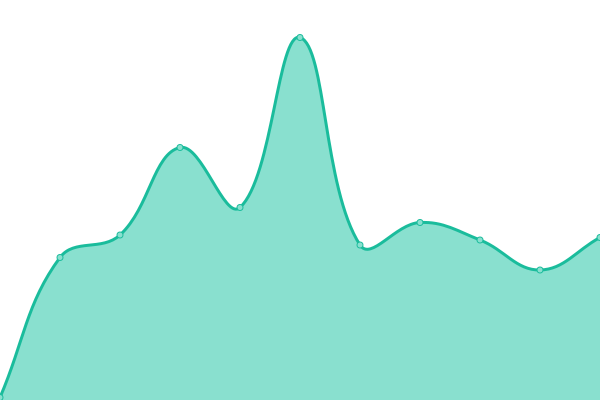
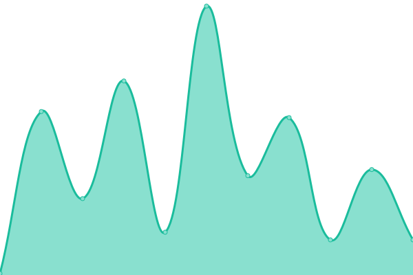

# [📈 Live Status](https://upptime.github.io/upptime): <!--live status--> **🟩 All systems operational**

This repository contains the open-source uptime monitor and status page for [Upptime](https://upptime.js.org), powered by [Upptime](https://github.com/upptime/upptime).

With [Upptime](https://upptime.js.org), you can get your own unlimited and free uptime monitor and status page, powered entirely by a GitHub repository. We use [Issues](https://github.com/upptime/upptime/issues) as incident reports, [Actions](https://github.com/upptime/upptime/actions) as uptime monitors, and [Pages](https://upptime.github.io/upptime) for the status page.

<!--start: status pages-->
<!-- This summary is generated by Upptime (https://github.com/upptime/upptime) -->
<!-- Do not edit this manually, your changes will be overwritten -->

| URL                                      | Status | History                                                                                            | Response Time                                                                     | Uptime                                                                                                                                                                                                                       |
| ---------------------------------------- | ------ | -------------------------------------------------------------------------------------------------- | --------------------------------------------------------------------------------- | ---------------------------------------------------------------------------------------------------------------------------------------------------------------------------------------------------------------------------- |
| [Google](https://www.google.com)         | 🟩 Up  | [google.yml](https://github.com/whistlerbrad/uptime/commits/master/history/google.yml)             |  78ms        |              |
| [Wikipedia](https://en.wikipedia.org)    | 🟩 Up  | [wikipedia.yml](https://github.com/whistlerbrad/uptime/commits/master/history/wikipedia.yml)       |  109ms    |        |
| [Whistlerpeak](https://whistlerpeak.com) | 🟩 Up  | [whistlerpeak.yml](https://github.com/whistlerbrad/uptime/commits/master/history/whistlerpeak.yml) |  400ms |  |

<!--end: status pages-->

[**Visit our status website →**](https://upptime.github.io/upptime)

## 📄 License

- Code: [MIT](./LICENSE) © [Upptime](https://upptime.js.org)
- Data in the `./history` directory: [Open Database License](https://opendatacommons.org/licenses/odbl/1-0/)
